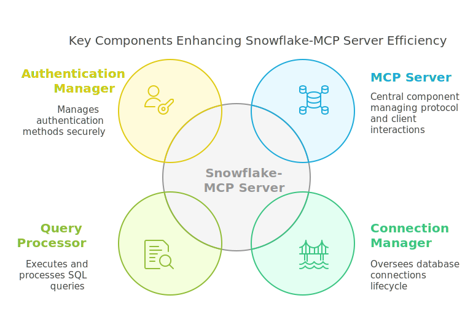
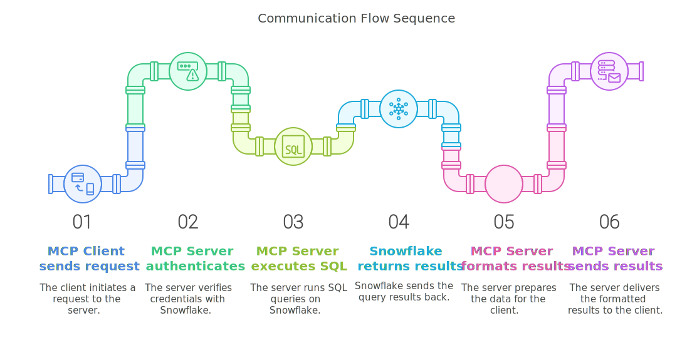

# Snowflake MCP Service

A Model Context Protocol (MCP) server that provides access to Snowflake databases for any MCP-compatible client.


This server implements the Model Context Protocol to allow any MCP client to:
- Execute SQL queries on Snowflake databases
- Automatically handle database connection lifecycle (connect, reconnect on timeout, close)
- Handle query results and errors
- Perform database operations safely
- Connect using either password or key pair authentication

## Architecture Overview

### What is MCP (Model Context Protocol)?

MCP is a standard protocol that allows applications to communicate with AI models and external services. It enables AI models to access tools and data sources beyond their training data, expanding their capabilities through a standardized communication interface. Key features include:

- Based on stdio communication (standard input/output)
- Structured tool definition and discovery
- Standardized tool call mechanism
- Structured results transmission

### System Components

The Snowflake-MCP server consists of several key components:

1. **MCP Server** - Central component that implements the MCP protocol and handles client requests
2. **Snowflake Connection Manager** - Manages database connections, including creation, maintenance, and cleanup
3. **Query Processor** - Executes SQL queries on Snowflake and processes the results
4. **Authentication Manager** - Handles different authentication methods (password or private key)



### Communication Flow

The system works through the following communication flow:

1. An MCP Client (such as Claude or other MCP-compatible application) sends a request to the MCP Server
2. The MCP Server authenticates with Snowflake using credentials from the `.env` file
3. The MCP Server executes SQL queries on Snowflake
4. Snowflake returns results to the MCP Server
5. The MCP Server formats and sends the results back to the MCP Client



This architecture allows for seamless integration between AI applications and Snowflake databases while maintaining security and efficient connection management.

## Installation

1. Clone this repository
```bash
git clone https://github.com/davidamom/snowflake-mcp.git
```

2. Install dependencies
```bash
pip install -r requirements.txt
```

## Configuration

### MCP Client Configuration Example

Below is an example configuration for Claude Desktop, but this server works with any MCP-compatible client. Each client may have its own configuration method:

```json
{
  "mcpServers": {
    "snowflake": {
      "command": "C:\\Users\\YourUsername\\path\\to\\python.exe",
      "args": ["C:\\path\\to\\snowflake-mcp\\server.py"]
    }
  }
}
```

Configuration parameters:
- `command`: Full path to your Python interpreter. Please modify this according to your Python installation location.
- `args`: Full path to the server script. Please modify this according to where you cloned the repository.

Example paths for different operating systems:

Windows:
```json
{
  "mcpServers": {
    "snowflake": {
      "command": "C:\\Users\\YourUsername\\anaconda3\\python.exe",
      "args": ["C:\\Path\\To\\snowflake-mcp\\server.py"]
    }
  }
}
```

MacOS/Linux:
```json
{
  "mcpServers": {
    "snowflake": {
      "command": "/usr/bin/python3",
      "args": ["/path/to/snowflake-mcp/server.py"]
    }
  }
}
```

### Snowflake Configuration

Create a `.env` file in the project root directory and add the following configuration:

```env
# Snowflake Configuration - Basic Info
SNOWFLAKE_USER=your_username          # Your Snowflake username
SNOWFLAKE_ACCOUNT=YourAccount.Region  # Example: MyOrg.US-WEST-2
SNOWFLAKE_DATABASE=your_database      # Your database
SNOWFLAKE_WAREHOUSE=your_warehouse    # Your warehouse

# Authentication - Choose one method
```

#### Authentication Options

This MCP server supports two authentication methods:

1. **Password Authentication**
   ```env
   SNOWFLAKE_PASSWORD=your_password      # Your Snowflake password
   ```

2. **Key Pair Authentication**
   ```env
   SNOWFLAKE_PRIVATE_KEY_FILE=/path/to/rsa_key.p8     # Path to private key file 
   SNOWFLAKE_PRIVATE_KEY_PASSPHRASE=your_passphrase   # Optional: passphrase if key is encrypted
   ```

   For key pair authentication, you must first set up key pair authentication with Snowflake:
   - Generate a key pair and register the public key with Snowflake
   - Store the private key file securely on your machine
   - Provide the full path to the private key file in the configuration

   For instructions on setting up key pair authentication, refer to [Snowflake documentation on key pair authentication](https://docs.snowflake.com/en/user-guide/key-pair-auth).

If both authentication methods are configured, the server will prioritize key pair authentication.

## Connection Management

The server provides automatic connection management features:

- Automatic connection initialization
  - Creates connection when first query is received
  - Validates connection parameters

- Connection maintenance
  - Keeps track of connection state
  - Handles connection timeouts
  - Automatically reconnects if connection is lost

- Connection cleanup
  - Properly closes connections when server stops
  - Releases resources appropriately

## Usage

The server will start automatically when configured with your MCP client. No manual startup is required in normal operation. Once the server is running, your MCP client will be able to execute Snowflake queries.

For development testing, you can start the server manually using:

```bash
python server.py
```

Note: Manual server startup is not needed for normal use. The MCP client will typically manage server startup and shutdown based on the configuration.

## Features

- Secure Snowflake database access
- Flexible authentication (password or key pair authentication)
- Robust error handling and reporting
- Automatic connection management
- Query execution and result processing
- Compatible with any MCP-compliant client

## Technical Details

### Core Components

The implementation consists of several key classes and modules:

- **server.py** - The main entry point containing the MCP server implementation.
- **SnowflakeConnection** - Class that handles all Snowflake database operations, including:
  - Connection establishment and reconnection
  - Query execution and transaction management
  - Connection maintenance and cleanup
- **SnowflakeMCPServer** - The main server class that implements the MCP protocol:
  - Registers available tools with the MCP framework
  - Handles tool call requests from clients
  - Manages the lifecycle of connections

### Connection Lifecycle

The connection lifecycle is carefully managed to ensure reliability:

1. **Initialization** - Connections are created lazily when the first query is received
2. **Validation** - Connection parameters are validated before attempting to connect
3. **Monitoring** - Connections are regularly tested for validity
4. **Recovery** - Automatic reconnection if the connection is lost or times out
5. **Cleanup** - Proper resource release when the server shuts down

### MCP Tool Interface

The server exposes the following tool to MCP clients:

- **execute_query** - Executes a SQL query on Snowflake and returns the results
  - Input: SQL query string
  - Output: Query results in a structured format

This implementation follows best practices for both MCP protocol implementation and Snowflake database interaction.

## License

[](https://opensource.org/licenses/MIT)

This project is licensed under the [MIT License](LICENSE). See the [LICENSE](LICENSE) file for details.

Copyright (c) 2025 David Amom

## Running with Docker

### Prerequisites
- Docker installed on your system
- Docker Compose installed on your system
- `.env` file configured with your Snowflake credentials

### Option 1: Using Docker Compose (Recommended)

1. **Build and start the container:**
   ```bash
   docker-compose up -d
   ```

2. **View logs:**
   ```bash
   docker-compose logs -f
   ```

3. **Stop the container:**
   ```bash
   docker-compose down
   ```

### Option 2: Using Make Commands

We provide a Makefile with useful commands to manage the Docker container:

- **Build the Docker image:**
  ```bash
  make build
  ```

- **Run the container (interactive mode):**
  ```bash
  make run
  ```

- **Run the container in background:**
  ```bash
  make run-detached
  ```

- **View container logs:**
  ```bash
  make logs
  ```

- **Stop the container:**
  ```bash
  make stop
  ```

- **Stop and remove the container:**
  ```bash
  make clean
  ```

- **Remove everything (container and image):**
  ```bash
  make clean-all
  ```

- **Show all available commands:**
  ```bash
  make help
  ```

### Container Access

The Snowflake MCP Server is accessible on port 8000. If your server is running locally, you can access it at: